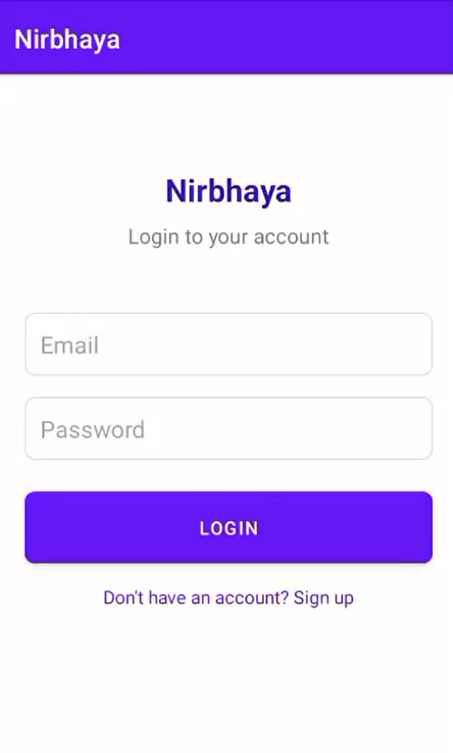
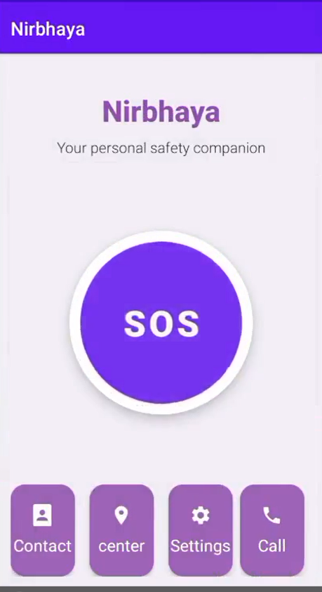

# 🚨 Nirbhaya – Women Safety App

  <b>Your Personal Safety Companion 💜</b> 
  Empowering safety with a single tap.

---

  
  
  
  

---

## 📱 Overview

**Nirbhaya** is an Android-based women safety application designed to provide instant emergency assistance.
With a simple UI and powerful features, users can quickly send alerts, call contacts, and access help during critical situations.

---

## ✨ Features

## ✨ Features

🆘 **One-Tap SOS Alert**
→ Instantly sends emergency alerts to saved contacts

📞 **Quick Call Option**
→ Call trusted contacts directly from dashboard

📇 **Emergency Contacts Management**
→ Add and manage multiple emergency contacts

🎭 **Fake Call Feature**
→ Simulates an incoming call to help escape uncomfortable or unsafe situations
→ Looks realistic and helps avoid suspicion

💬 **Suggestion Box**
→ Users can send feedback or report issues
→ Helps improve app functionality and user experience

🎯 **Simple & Fast UI**
→ Designed for quick access in panic situations

⚙️ **Quick Actions Panel**
→ Contact | Center | Settings | Call

---

## 🖼️ App Preview

## 🖼️ App Preview

  
  

  
  

---

## 🛠️ Tech Stack

  

---

## 🔐 Permissions Required

* 📍 Location
* 📩 SMS
* 📞 Call
* 📇 Contacts

---

## 🚀 How It Works

1️⃣ Register in the app
2️⃣ Add emergency contacts
3️⃣ Open dashboard
4️⃣ Tap **SOS button**
5️⃣ Alert is sent instantly 🚨

---

## 💡 Future Enhancements

* 🎙️ Voice-trigger SOS
* 📍 Live GPS tracking
* 👮 Police integration
* 🤖 AI-based threat detection

---

## 👩‍💻 Developer

**Mansi Mishra**
🎓 B.Tech CSE Student

---

## ⭐ Support

If you like this project:

🌟 Star this repository
🍴 Fork it
📢 Share it

---

  ❤️ Built with purpose to make the world safer

  
